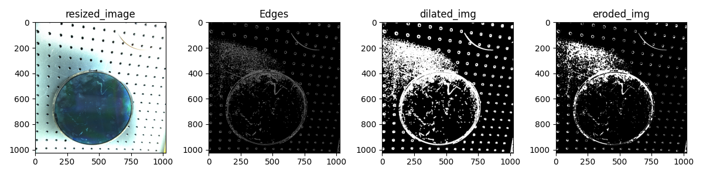
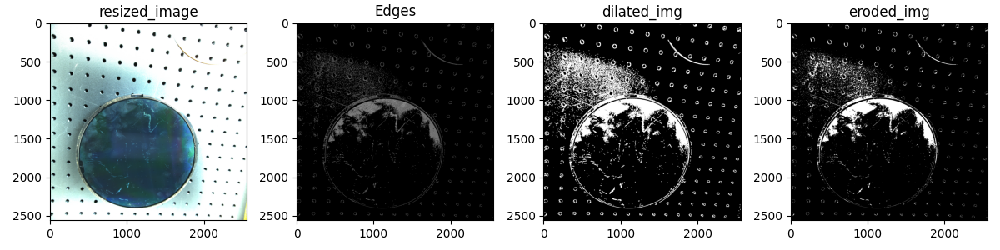

# 任务总结

## 任务目标：

给定涂有光刻胶的晶圆片的图片，要求检测出上面的污渍。

刚开始的时候给了很多各个角度的晶圆图片，图片内容包含一个晶圆（可能并不是垂直向下），以及其他背景。开始以为要求是首先将晶圆分割出来，这时如果垂直角度拍摄就是圆形，侧面拍摄则可能是椭圆形，所以以为是需要将图片中的椭圆形晶圆片还原成圆形，最后把晶圆片上的光刻胶上的污渍检测出来。

但是后面进一步发现并不要求是实现任意角度下的晶圆片光刻胶检测，因此可以选一个最好的角度（最接近圆的），而后可以自己把图片截出来，之后再进行污渍检测。

## 任务分析

原图片特点和问题：

一、图片大小
原图片过于大了，大小为5120*5120

背景是工作台，工作台十分粗糙，高分辨率+漫反射，所以边缘检测的话会十分困难。因为这样的表面在有阴影的时候不会完全黑，而由于分辨率又十分大，所以有很多细节都会被边缘检测扫描出来，结果就是会有很多一小段一小段的细线（采用了下采样和腐蚀膨胀的操作削弱影响，下采样后的效果就很好）。

二、原图片的拍摄条件不一样
原图片形态各异，有的对好焦了，有的没有对好（这样边缘检测就有些困难），有的背景深，有的背景浅（这样可能导致对于设定好的边缘检测算子和腐蚀膨胀迭代参数不普适），所以需要进一步明确需求，具体是要对什么样的晶圆片进行操作（这一点已经解决了，就是自己找出来对焦精准的，并且位置比较正的）。

三、原任务是有两类的图片，一类主要部分结构平滑

另一类主要结构比较丰富（这张就是经过裁剪之后的图片，3072x3072）

## 解决办法

### 结构平滑的图像

对于两种图片采取了两种不同的解决办法。对于结构平滑的图像，采取的是经典方法如下。

#### 1、转为灰度图

这一步也可以专门采用bgr三个通道中的某一个，效果可能会更好。对于其他的情况，甚至可以考虑把不同的通道混合起来看灰度效果。

#### 2、二值化

灰度图进行二值化处理

#### 3、形态学处理

例如开闭运算，用来去除噪点和孤立的小区域

#### 4、使用Canny算子进行边缘检测

#### 5、寻找轮廓

不过这里为了解决噪声多的问题，首先要对于图片下采样，变成512*512。下面的图片分别是原图片、下采样成1024x1024的图片、下采样成512x512的图片，Canny的参数是200和250，可以看到放大看的话原图片中的很多地方是一些细节，只不过因为分辨率太大了所以被Canny算做边缘输出了

### 结构不平滑的图像

对于这类图像，其中重复的结构或者纹理特别多，就可以采用傅里叶变换，而后使用低通滤波器，下面是详细的步骤：
1、灰化
2、傅里叶变换
3、低通滤波器
4、傅里叶逆变换

## findcontour()
用于查找（或者说是计算轮廓的函数），接受的只能是二值图像，背景黑，内容白，返回的是两个元组（列表？）：**contours**和**hierarchy**，第一个表示找到的轮廓，第二个表示这些轮廓的层次关系

**findcontour(img, mode, method)**
其中第一个参数就是需要查找轮廓的图像，第二个是轮廓检索模式，第三个是轮廓近似方法

### 轮廓检索模式（contour retrieval mode）
**cv2.RETR_EXTERNAL**
只返回最外围的轮廓
下面三个参数都是会返回检测到的所有轮廓，只不过排列顺序不一样而已
**cv2.RETR_LIST**
返回所有轮廓，不过应该只是逐个放到列表中而已，不进行任何的排序
**cv2.RETR_CCOMP**
其中CCOMP代表Connected Components，设定这个参数，会返回所有轮廓，并且将它们按照层次顺序排序，即小轮廓包含在大轮廓里面，但是似乎只有两层
**cv2.RETR_TREE**
返回所有轮廓，并是按照完整的包含关系

这里没有逐个查看不同的mode的返回效果，总体上从包含关系来说cv2.RETR_TREE应该是包含了其他所有的mode，可能需要查看一下findcontour()具体是怎么实现的。基本来说最常用的是最后一个**cv2.RETR_TREE**

### 轮廓近似方法（contour approximation method）
这里只有两个参数可供选择，这两个参数的区别主要在于有什么方式来描述轮廓
**cv2.CHAIN_APPROX_NONE**
用每个点去轮廓，即把一个轮廓的所有点都储存起来表示轮廓
**cv2.CHAIN_APPROX_SIMPLE**
用直线去表示轮廓，只储存轮廓的端点，能够很大程度上节约空间

## fitellipse()
这个算子用于使用椭圆拟合点集，在实际使用时（至少目前来看）的效果并不好。
原因应该是它似乎是根据整个图像中的亮点个数进行拟合的，因此如果噪点太多、密集集中在某一个区域的话效果就不好了

## HoughCircle()

## 改变图像大小的两种方法：resize()和pyrdown()
因为图像中需要进行下采样以减少细节，所以寻找了不同的下采样方法
下面的第一张图片是原图像，后两张图片是使用resize()和pyrdown()的图片细节，都是5120x5120下采样成1024x1024，这两张图片在下采样后经过了Canny(200, 250)和d2e2d2e2，可以看出来感觉金字塔池化还是更好地去除了左上方应该被视为是噪声的细节，并且对于晶圆内部的细节得到了更好的保留

### pyrdown()
金字塔池化分为pyrdown()和pyrup()，一个是向下采样，一个是向上采样，后面的高斯金字塔和拉普拉斯金字塔对应于pyrdown()和pyrup()的堆叠。
其中，pyrdown()先用高斯滤波器卷积后删除偶数列
### pyrup()
### 高斯金字塔
高斯金字塔采样方法：高斯核扫描+抽掉偶数行和列，按理说每次扫描完后应该是长宽缩短为原来的二分之一，面积变为原来的四分之一，但是实际使用的时候可以自己设定扫描之后的长宽像素，不清楚是为什么
### 拉普拉斯金字塔
原图像-扫描后图像，即返回的图像类似于边缘检测，大片部分是黑色的，只有边缘附近是彩色的
### resize()

## HoughCircle()
霍夫变换